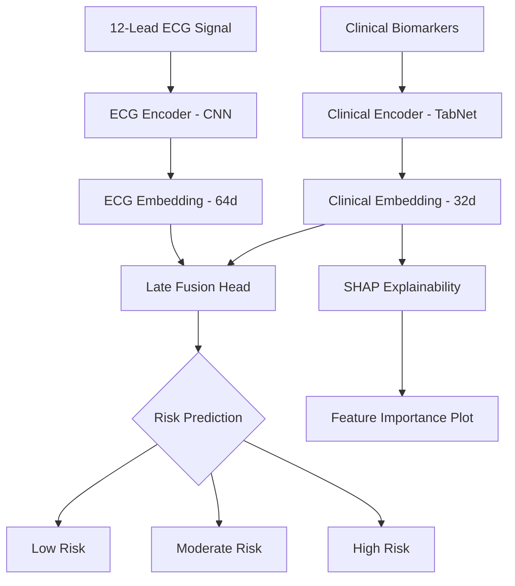

# CardioAlert: Multimodal Cardiac Risk Assessment

CardioAlert is a state-of-the-art Deep Learning platform designed for early detection of cardiac distress through the multimodal fusion of 12-lead ECG signals and clinical biomarkers.


## 🚀 Key Features

- **Multimodal Fusion**: Combines high-fidelity ECG embeddings with tabular clinical data for superior diagnostic accuracy.
- **Deep Learning Pipelines**:
  - **ECG Encoder**: 1D-CNN architecture optimized for 12-lead signal processing (PTB-XL dataset).
  - **Clinical Encoder**: TabNet-based architecture for learning complex tabular relationships (UCI Heart Disease dataset).
- **Explainable AI (XAI)**: Integrated **SHAP (SHapley Additive exPlanations)** to provide feature-level transparency for every prediction.
- **Interactive Dashboard**: A premium, dark-mode web interface for real-time risk assessment and visualization.

## 🛠️ Architecture



## 📦 Installation

1. **Clone the repository**:
   ```bash
   git clone https://github.com/haritha2k5/CardioAlert.git
   cd CardioAlert
   ```

2. **Setup Virtual Environment**:
   ```bash
   python -m venv venv
   .\venv\Scripts\activate
   ```

3. **Install Dependencies**:
   ```bash
   pip install -r requirements.txt
   ```

## 🖥️ Usage

### 1. Training the Pipelines
To train the individual encoders and the fusion model:
```bash
# Train Clinical Pipeline
python -m src.clinical_pipeline.train

# Train ECG Pipeline
python -m src.ecg_pipeline.train

# Train Fusion Model
python -m src.fusion.train_fusion
```

### 2. Running the Dashboard
Launch the FastAPI server to access the web interface:
```bash
python -m api.main
```
Navigate to `http://localhost:8000` in your browser.

## 📊 Dataset Reference
- **Clinical Data**: UCI Heart Disease Dataset (920 records).
- **ECG Data**: PTB-XL A large publicly available electrocardiography dataset (21,837 records).

## 🛡️ License
This project is developed for clinical research purposes. Always consult a professional cardiologist for medical diagnosis.
